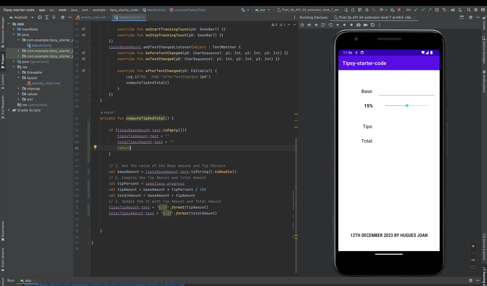
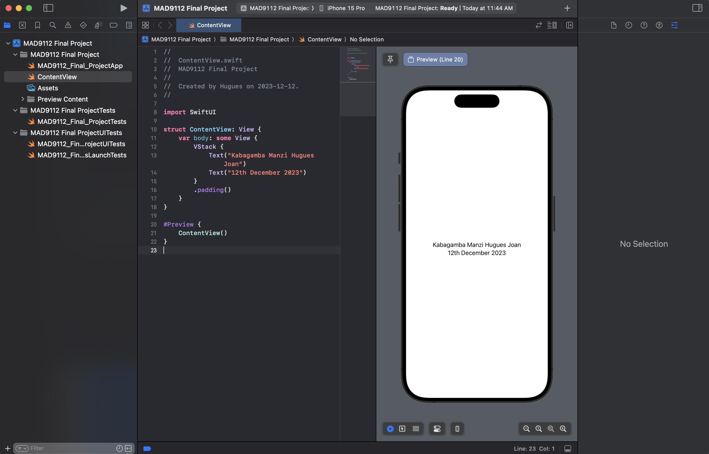

# HuguesJoan_KabagambaManzi_FinalProject

### step 1
```
function getDaysUntilChristmas() {
    let date = new Date;
    let christmas = new Date
    christmas.setDate(25)
    christmas.setFullYear(2023)
    christmas.setMonth(11)
    return christmas.getDate() - date.getDate();
}
console.log(`${getDaysUntilChristmas()} days left until christmas 🎄🎅`)
```



